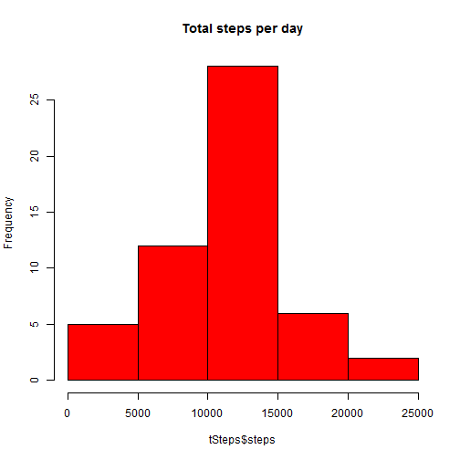
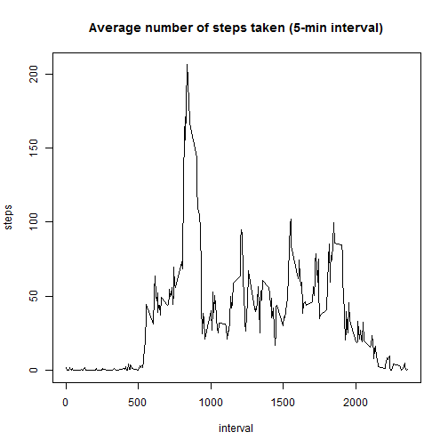
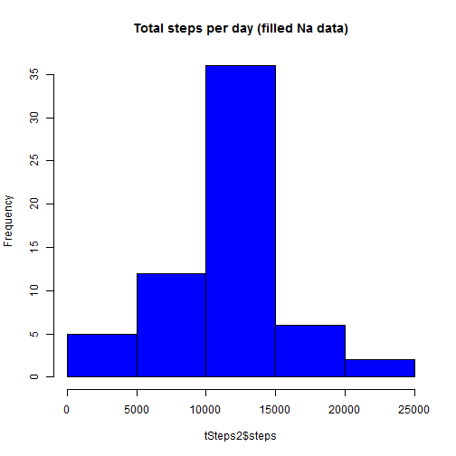
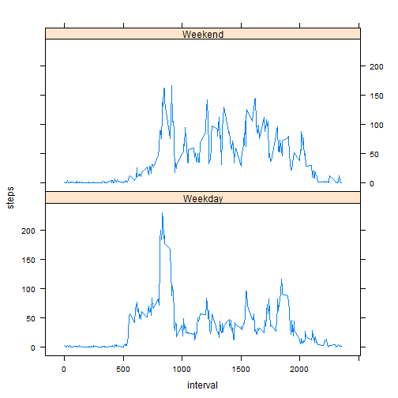

Reproducible Research - Peer assignment 1
=========================================

### Loading the data

* Load the data

```r
filename <- "activity.csv"
dataSourceDir <- "data"

# filepath
sourceloc = sprintf("%s/%s", dataSourceDir, filename)


# reading table
data <- read.csv(sourceloc, sep = ",", header = TRUE, colClasses = c("integer", 
    "Date", "integer"))
```

* Process/transform the data (if necessary) into a format suitable for your analysis  

```r
dataNoNa <- data[!is.na(data$steps), ]
tSteps <- aggregate(steps ~ date, data = dataNoNa, sum)
```

### What is mean total number of steps taken per day?

* Make a histogram of the total number of steps taken each day

```r
hist(tSteps$steps, main = "Total steps per day", col = "red")
```

 

* Calculate and report the mean and median total number of steps taken per day

The Mean total number of steps taken per day:

```r
mean(tSteps$steps)
```

```
## [1] 10766
```

The Median total number of steps taken per day:

```r
median(tSteps$steps)
```

```
## [1] 10765
```


### What is the average daily activity pattern?

* Make a time series plot (i.e. type = "l") of the 5-minute interval (x-axis) and the average number of steps taken, averaged across all days (y-axis)


```r
iSteps <- aggregate(steps ~ interval, data = dataNoNa, mean)
plot(steps ~ interval, data = iSteps, type = "l", main = "Average number of steps taken (5-min interval)")
```

 


* Which 5-minute interval, on average across all the days in the dataset, contains the maximum number of steps?

Interval which has a maximum number of steps:

```r
iSteps[which.max(iSteps$steps), ]$interval
```

```
## [1] 835
```

###  Imputing missing values

* Calculate and report the total number of missing values in the dataset (i.e. the total number of rows with NAs)

Total number of rows with NAs:

```r
sum(is.na(data$steps))
```

```
## [1] 2304
```

* Devise a strategy for filling in all of the missing values in the dataset. The strategy does not need to be sophisticated. For example, you could use the mean/median for that day, or the mean for that 5-minute interval, etc.

For Na values in the dataset, it is used the mean of that 5-minute interval.
 
* Create a new dataset that is equal to the original dataset but with the missing data filled in.


```r
dataNaFull <- data
for (inx in 1:nrow(dataNaFull)) {
    if (is.na(data$steps[inx])) 
        dataNaFull$steps[inx] <- iSteps[iSteps$interval == data$interval[inx], 
            ]$steps
}
```

* Make a histogram of the total number of steps taken each day and Calculate and report the mean and median total number of steps taken per day. Do these values differ from the estimates from the first part of the assignment? What is the impact of imputing missing data on the estimates of the total daily number of steps?

```r
tSteps2 <- aggregate(steps ~ date, data = dataNaFull, sum)
hist(tSteps2$steps, main = "Total steps per day (filled Na data)", col = "blue")
```

 

The mean:

```r
mean(tSteps2$steps)
```

```
## [1] 10766
```

The median:

```r
median(tSteps2$steps)
```

```
## [1] 10766
```

The mean value is the same, but the median value is a little bit different. Actually, there is no impact of imputing missing data.   


### Are there differences in activity patterns between weekdays and weekends?

* Create a new factor variable in the dataset with two levels – “weekday” and “weekend” indicating whether a given date is a weekday or weekend day.


```r
# English language
Sys.setlocale("LC_TIME", "C")
```

```
## [1] "C"
```

```r

dataNaFull$day = sapply(dataNaFull$date, function(x) {
    day <- weekdays(x)
    ifelse(day == "Saturday" | day == "Sunday", "Weekend", "Weekday")
})
```


* Make a panel plot containing a time series plot (i.e. type = "l") of the 5-minute interval (x-axis) and the average number of steps taken, averaged across all weekday days or weekend days (y-axis). The plot should look something like the following, which was creating using simulated data:


```r
iSteps2 = aggregate(steps ~ interval + day, data = dataNaFull, mean)
library(lattice)
```

```
## Warning: package 'lattice' was built under R version 3.0.3
```

```r
xyplot(steps ~ interval | factor(day), data = iSteps2, layout = c(1, 2), type = "l")
```

 


Yes, there is a difference in activity patterns between weekdays and weekends. Differences are expected due to various daily activities.
